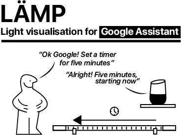

Smart lights have exisited for quite some time, but their current form factor often limits the functionality to merely lighting up a room. By putting similair hardware in a tastefully designed tube, more visual information can be displayed while seamlessly blending into the rest of the room and furniture.

This repo contains 3D assets, a wiring diagram and the software required to build this project.  

An instructable explaining the build process can be found here:
https://www.instructables.com/id/IoT-RGB-Design-Lamp-With-IFTTT/

